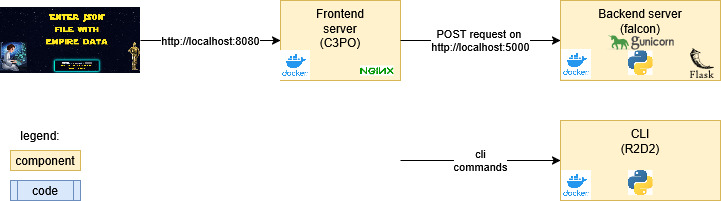

## Architecture


## Structure of the repository:

The application is composed of one Flask (v3.1.2) backend and one Angular (v20.3.8) frontend with the following structure:

```
.
├── .env                     # docker-compose env
├── docker-compose.yaml
├── backend                  # flask backend dir
    ├── ...
├── docs                     # documentation dir
    ├── ...                  
├── frontend                 # Angular frontend dir
    ├── ...                  
├── pre-commit-config.yaml
├── README.md
└── tests
```

### Backend

```
backend
├── Dockerfile.backend
├── examples
│   ├── ...
├── pyproject.toml
├── requirements.in
├── requirements.txt
└── src
    ├── __init__.py
    ├── app.py
    ├── cli.py
    ├── config.py         # flask app config
    ├── log_tools.py      # logging helper
    ├── millenium_router  # functional logic
      ├── ...
    └── wsgi.py           # entrypoint for flask and gunicorn
```

### Frontend
Only the main folders/files are printed here.

```
...
├── Dockerfile.frontend
├── angular.json
├── docker-entrypoint.sh  # script for the token substitution
├── nginx.conf           
├── public                # pictures
│   ├── ...
├── src
│   ├── app               # application root component
│   ├── environments      # environment configurations
│   ├── index.html
│   ├── main.ts
│   └── styles.scss
...
```

## Pre-requisites 

### Dependencies to run the project:
```
docker
docker-compose
```

### Dependencies to build the project:
```
uv
Python 3.11+
Angular 20.3.9
docker
docker-compose
```

## Build the project & development mode
> **!** All this section describes the commands to build and run the different components of the project in development phase. For production, please jump to [Run in production](#run-in-production).  

### Build and run the backend
I recommend using uv for build the projects but it should work also with other python package manager.

> **!** All the non-Docker instructions below should be performed in a dedicated virtualenv.

#### How to compile Python dependencies
In the project we are using uv pip compile to ensure dependency compatibility, versions...

`uv pip compile requirements.in -o requirements.txt`

#### How to install Python dependencies 
You can then install the requirements in your virtual environment.

`uv pip install -r requirements.txt`

#### Install the Python project
`uv pip install -e .`

This will package the project and give access to the CLI.

#### How to run the CLI
In `backend` folder, you can run:
```sh
give-me-odds examples/example2/millennium-falcon.json examples/example2/empire.json
```

`give-me-odds` was added to the `PATH` when you installed the project as a package as defined in `backend/pyproject.toml`.

#### How to run the application with flask
In development mode, you can directly run flask by running in `backend` folder:  
```sh
(.venv) me> flask --app src.wsgi:application run
... (setup all loggers in DEBUG mode)
...
2025-11-12 09:50:33,892 - backend.app - INFO - Initializing session
AUTONOMY=6
DEPARTURE=Tatooine
ARRIVAL=Endor
 * Debug mode: off
2025-11-12 09:50:33,966 - werkzeug - INFO - WARNING: This is a development server. Do not use it in a production deployment. Use a production WSGI server instead.
 * Running on http://127.0.0.1:5000
2025-11-12 09:50:33,966 - werkzeug - INFO - Press CTRL+C to quit
```

Now the backend flask application is running and exposed on the url [http://127.0.0.1:5000](http://127.0.0.1:5000).

In development mode, all the loggers are at `DEBUG` level.

#### How to run the application with gunicorn

Flask framework is not meant to serve the application in production, that's why we are using gunicorn server.

You can run it this way from the `backend` directory:  
```sh
gunicorn --bind 0.0.0.0:5000 src.wsgi:application
```

With this command the app will listen on http://localhost:5000.

#### How to run the application with Docker
In this section, you find all the detailled docker command to perform the different actions (build, run) on the different containers during development phase.

##### Docker build

The commands below should be run in the root folder.
To build the backend image:
```sh
docker build -f backend/Dockerfile.backend -t backend:0.0.1 ./backend
```

To run the backend image:
```sh
docker run -p 5000:5000 --name backend backend:0.0.1
```

#### How to run the CLI

##### How to run the CLI in the Python env
In `backend` folder, you can run:
```sh
give-me-odds backend/examples/example2/millennium-falcon.json backend/examples/example2/empire.json
```

Note: the CLI has an extra flag `--debug` to switch log level to `DEBUG`.

##### How to run the CLI on the running docker container
Pre-requisite : the backend docker container is running.

```sh
docker exec -it backend give-me-odds examples/example1/millennium-falcon.json examples/example1/empire.json
```
### Build and run the frontend

#### With Angular:
In `frontend` directory:
```sh
ng serve
```

#### With the docker container:
To build the frontend image:
```sh
docker build -f frontend/Dockerfile.frontend -t frontend:0.0.1 ./frontend
```

> **!** Keep in mind that frontend will communicate to the backend on a specific port. Both components should be aligned on the port. To see how it is done in production, see.  [Configuration in Production](#configuration-in-production)

To run the frontend image:
```sh
docker run -p 8080:8080 --name frontend frontend:0.0.1
```

## Run in production
The recommended way to run the project in production is with docker-compose.

It is going to start smoothly backend first then frontend.

### Configuration in production
The main configuration variables relevant for running in production are defined in the docker-compose env file `./.env`.

The variables are propagated in the containers.
```
ENV=production
BACKEND_PORT=5001
FRONTEND_PORT=8080
```

ENV triggers which Config from `./backend/config.py` is going to be used.

BACKEND_PORT defines on which port on backend side is used (also used by the frontend to know which port to target).

FRONTEND_PORT defines on which port on frontend side is used (also used by the backend to whitelist).

> **⚠️ Warning: There is a token substitution on frontend side !**  
> The JS files are compiled before the variable FRONTEND_URL is available.
> As a solution, the JS files are compiled using a TOKEN `BACKEND_URL_PLACEHOLDER_TOKEN` that is replaced at the last stage of build by the script `frontend/docker-entrypoint.sh` as defined in `frontend/Dockerfile.frontend`

### How to run the application with docker-compose
`docker-compose up -d`

> -d option: flag to detach the container and let them run in the background

#### CLI

##### How to run the CLI on the docker container
Once the backend container is running, it exposes the CLI.
```sh
docker exec -it flask_backend_app give-me-odds backend/examples/example1/millennium-falcon.json backend/examples/example1/empire.js
```
In the example, flask_backend_app is the container name given by docker-compose.

> **⚠️ Warning: CLI can only access the files already inside the container !**
>
> The container as defined in the current state  
> of the repo only contain `backend/examples` files.  
> See [Limitations and Future evolutions](#limitations-and-future-evolutions)
>  

## Project input files
Mostly taken from the project instructions.

### millennium-falcon data

**millennium-falcon.json**
```json
{
  "autonomy": 6,
  "departure": "Tatooine",
  "arrival": "Endor",
  "routes_db": "universe.db"
}
```
   - autonomy (integer): autonomy of the Millennium Falcon in days.
   - departure (string): Planet where the Millennium Falcon is on day 0.
   - arrival (string): Planet where the Millennium Falcon must be at or before countdown.
   - routes_db (string): Path toward a SQLite database file containing the routes. The path can be either absolute or relative to the location of the `millennium-falcon.json` file itself.

The SQLite database will contain a table named ROUTES. Each row in the table represents a space route. Routes can be travelled **in any direction** (from origin to destination or vice-versa).

   - ORIGIN (TEXT): Name of the origin planet. Cannot be null or empty.
   - DESTINATION (TEXT): Name of the destination planet. Cannot be null or empty.
   - TRAVEL_TIME (INTEGER): Number days needed to travel from one planet to the other. Must be strictly positive.

| ORIGIN   | DESTINATION | TRAVEL_TIME |
|----------|-------------|-------------|
| Tatooine | Dagobah     | 4           |
| Dagobah  | Endor       | 1           |

### empire data

a JSON file containing the data intercepted by the rebels about the plans of the Empire and displaying the odds (as a percentage) that the Millennium Falcon reaches Endor in time and saves the galaxy.

**empire.json**
```json
{
  "countdown": 6, 
  "bounty_hunters": [
    {"planet": "Tatooine", "day": 4 },
    {"planet": "Dagobah", "day": 5 }
  ]
}
```

   - countdown (integer): number of days before the Death Star annihilates Endor
   - bounty_hunters (list): list of all locations where Bounty Hunter are scheduled to be present.
      - planet (string): Name of the planet. It cannot be null or empty.
      - day (integer): Day the bounty hunters are on the planet. 0 represents the first day of the mission, i.e. today.


## Limitations and Future evolutions

### Security
Here are the following security measures:
- user in backend is appuser and not root
- user in frontend container is nginx and not root
- backend allows requests only from `FRONTEND_URL` defined in the docker-compose

> TODO: before shipping to production, we should thoroughly review the measures.

### CLI
One limitation with CLI in production mode (meaning run with Docker/docker-compose) is that it can only access data files that are initially present in the container at build time.

Currently the files are the examples files from the repos in `./backend/examples`.

For example:
```sh
docker exec -it flask_backend_app give-me-odds backend/examples/example1/millennium-falcon.json backend/examples/example1/empire.json
>>>0
```

In order to allow to run the CLI on any file, we could bind a local volume to a container volume. In that case, we can point any file in that binded volume.

Here the new backend section of the docker-compose.yaml. Check the volume section to bind the local `./backend/examples` to a folder in the container in `/tmp/examples`.

```yaml
services:
  backend:
      build: 
        context: ./backend
        dockerfile: ./Dockerfile.backend
      environment:
        - ENV=production
      ports:
        - "5000:5000"
      restart: always
      container_name: flask_backend_app
      volumes:
        - ./backend/examples:/tmp/examples:ro
...
```

### Path finding algorithm speed
Current we rely on a sqlite on-disk database system.

Benefits:
- it is not limited to memory size and will support large universe size.
- it is simply using the input file

Drawbacks:
- it will be pretty slow because of disk read speed
- the database has no index
- the full database is scanned at each search
- repeated searches are not cached

Possible evolutions:

#### Refactor db
At start time, we could read the sqlite file and create another db (could be another sqlite file) with two improvements:
- remove all jumps with travel_time > autonomy
- index fields origin and travel_time since the `WHERE` clause is relying on them

#### Load some data in memory
- use in-memory DB if the graph fits
- use lru_cache on redundant queries

#### Asynchronously find path
During the time when the application is idle, we could search for physically feasible paths and create compound path in the database.

For example: if the path Tatooine (0) -> Hoth (1) -> Endor (4) is found, we could log a compound path in the db
Tatooine -> Endor (4) {"visited":[Hoth (1)]}

At search time, we can use these compound jumps and apply the bounty_hunter catch logic afterwards.

Please note that the benefits of this approach highly depends on the size and the cardinality of the graph. For highly connected graphs, there might be too many compound paths to store.


### Testing
Current there are unit test only on the backend part.

What is missing:
- unit tests on the frontend part
- integration tests
- end to end tests
